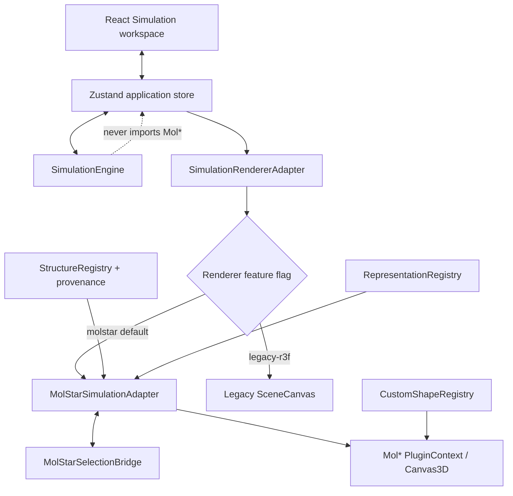

# Architecture

## Phase 1–2 Mol* migration

Mol* is the default Simulation renderer. The simulation engine remains the only source of
truth; the renderer receives entity identifiers and selection state through an adapter. The
legacy R3F scene remains available through `NEXT_PUBLIC_SIMULATION_RENDERER=legacy-r3f`.



The live Phase 2 scene lazily initializes one PluginContext, fetches the bundled experimental
RCSB 6MV4 mmCIF from `/structures/6mv4.cif`, and renders Factor IXa. The vessel boundary,
damage band, and conceptual fallback entities are Mol* shapes rather than fake molecular
structures. Unmount, abort, malformed fixture, WebGL unavailability, and context loss all
produce an explicit lifecycle state.

The structure registry distinguishes experimental, predicted, isolated-domain,
representative, and conceptual evidence. A provenance descriptor does not claim that a
simulation node is a complete physiological structure. Only same-origin, typed
`/structures/*` fixtures can be loaded by the current adapter; arbitrary URLs are not accepted.

Phase 3+ remains intentionally out of scope: typed visual reaction phases, event animation,
full replay, Reaction Explorer playback, and Molecule Explorer representation controls.

## Layer model

The codebase is stratified so that the model can be reasoned about and tested in complete
isolation from the browser.

```
┌────────────────────────────────────────────────────────────────┐
│  src/app/           Server-rendered shell (layout, one route)  │
│                     ↓ renders                                   │
│  AppShell           ← the single 'use client' boundary          │
├────────────────────────────────────────────────────────────────┤
│  React UI layer                                                 │
│    components/controls/    components/dashboard/                │
│    components/molstar/     rendering/       components/three/   │
│    hooks/                                                       │
├────────────────────────────────────────────────────────────────┤
│  store/simulationStore.ts   Zustand — owns policy & throttling  │
├────────────────────────────────────────────────────────────────┤
│  simulation/                Pure model. No React, DOM, or WebGL │
│    types  entities  reactions  engine  scheduler                │
│    snapshots  particles  numeric                                │
└────────────────────────────────────────────────────────────────┘
```

The dependency arrows only ever point downward. `src/simulation/` imports nothing from
React, the DOM, or three.js — which is why the whole model is tested in a plain Node
environment with no mocks.

## The client boundary

[`src/app/page.tsx`](../src/app/page.tsx) is a server component that renders
[`AppShell`](../src/components/dashboard/AppShell.tsx). `AppShell` carries the `'use client'`
directive, so everything beneath it runs in the browser. There is no other client boundary,
and there are no server actions. `SimulationViewport` adds a client-only dynamic boundary for
Mol*, so no Mol* module is evaluated during server rendering. The only application fetch in
Phase 2 reads the curated same-origin mmCIF fixture after Canvas3D initialization.

`AppShell` is also where the two global hooks are mounted exactly once:

- [`useSimulationClock`](../src/hooks/useSimulationClock.ts) — the single real clock loop.
- [`useKeyboardControls`](../src/hooks/useKeyboardControls.ts) — the global shortcut layer.

## The two-clock model

This is the most important architectural decision in the project, and the one most likely to
be broken by a careless change.

The engine advances on an animation-frame clock, but **React state is published at roughly
12 Hz**, not 60 Hz. The legacy R3F layer can read the engine inside its own render loop; the
Phase 2 Mol* layer consumes stable selection and published state without advancing the engine.
A 60 Hz Canvas3D scene therefore does not cause 60 Hz React re-renders.

```
requestAnimationFrame
        │
        ▼
  createScheduler            src/simulation/scheduler.ts
        │  onFrame(deltaSeconds)
        ▼
  store.advanceFrame(delta)  src/store/simulationStore.ts
        │
        ├─► engine.advance(delta) ──► N × engine.step()   (fixed 1/60 steps)
        │
        └─► every PUBLISH_INTERVAL_SECONDS (1/12 s):
                set({ frame: captureFrame() })
                        │
                        ▼
        ┌───────────────┴────────────────┐
        │                                │
   React subscribers              (bypasses React)
   controls, charts,                     │
   inspector, timeline,          useEngineFrame()  ← useFrame, ~60 Hz
   text mirror, KPIs                     │
                                  getEngine().getState()
                                         │
                                  three.js meshes,
                                  mutated in place
```

Three consequences worth internalizing:

1. **The 3D layer never advances the engine.** `useEngineFrame` reads only. If it also
   stepped, the scene and the app clock would race and the run would stop being
   deterministic. The clock in `AppShell` is the only writer.
2. **The scene keeps running when WebGL is unavailable.** Because the clock is mounted in
   `AppShell` rather than inside the `<Canvas>`, the model advances and every readout stays
   live even when the DOM-only fallback is showing.
3. **The engine mutates its `levels` record in place** so the render loop can read it without
   allocating. Any caller that keeps values across frames — notably the store — must copy
   first. `captureFrame()` does exactly that, and `recordSnapshot()` likewise copies levels,
   signals, and reaction activity into each snapshot.

While the timeline is being scrubbed the picture inverts: `useEngineFrame` serves the
**scrubbed snapshot** instead of the engine's live state, so the 3D scene replays history
alongside every DOM readout. See [rendering-3d.md](rendering-3d.md#useengineframe--the-read-only-bridge).

## Data flow for a user interaction

Taking "user drags the vessel damage slider" as the representative case:

1. [`NormalizedSlider`](../src/components/controls/NormalizedSlider.tsx) fires `onChange`
   with the raw input value.
2. `store.setVesselDamageSignal(value)` runs `parseNormalized`. Unusable input is **silently
   dropped**; the committed value is left alone.
3. On success the store calls `engine.configure({ vesselDamageSignal })`, which re-validates
   through `assertNormalized` and would throw on garbage.
4. The store re-reads `engine.getConfig()` into React state, so control components re-render
   with the new value immediately — config updates are *not* throttled, only frames are.
5. On the next animation frame the engine's step loop reads the new value when computing the
   flux of the initiation edge.
6. Within ~83 ms the store publishes a new `frame`, and charts, readouts, inspector, and text
   mirror update. The 3D layer picked up the change on the very next frame.

## Module map

### `src/simulation/` — the pure model

| File | Responsibility |
|---|---|
| [`types.ts`](../src/simulation/types.ts) | Every shared contract: `EntityId`, `EntityDefinition`, `ReactionDefinition`, `SimulationConfig`, `DerivedSignals`, `SimulationEngine`. Start here. |
| [`entities.ts`](../src/simulation/entities.ts) | The thirteen node definitions and factory helpers for level/flag records. |
| [`reactions.ts`](../src/simulation/reactions.ts) | The seven edge definitions, plus `GRAPH_EDGES` — a flattened edge list used by the accessibility mirror and the fallback view. |
| [`engine.ts`](../src/simulation/engine.ts) | The deterministic fixed-step integrator. The largest and most load-bearing file. |
| [`scheduler.ts`](../src/simulation/scheduler.ts) | Dependency-injected animation-frame loop. Owns *when* the engine advances; the engine owns *how far*. |
| [`snapshots.ts`](../src/simulation/snapshots.ts) | `RingBuffer`, the snapshot/event capacities, and `clampSnapshotIndex`. |
| [`particles.ts`](../src/simulation/particles.ts) | Pure allocation of the 400-instance visual budget across nodes. |
| [`numeric.ts`](../src/simulation/numeric.ts) | The only place the 0–1 invariant is enforced. `clamp01`, `parseNormalized`, `assertNormalized`, display formatters. |
| [`reactionTrace.ts`](../src/simulation/reactionTrace.ts) | Pure visualization helper. Precomputes, per node, the upstream production path leading to it and the set of nodes it shares an edge with. Reads reaction definitions only — it computes no flux and no levels. |

### `src/store/` and `src/presets/`

| File | Responsibility |
|---|---|
| [`simulationStore.ts`](../src/store/simulationStore.ts) | Module-level singleton engine, the Zustand store wrapping it, publish throttling, and `selectDisplayed`. |
| [`scenarios.ts`](../src/presets/scenarios.ts) | Seven named starting points. `buildPresetConfig` always derives fresh from defaults, so presets cannot contaminate each other. |

### `src/hooks/`

| File | Responsibility |
|---|---|
| [`useSimulationClock.ts`](../src/hooks/useSimulationClock.ts) | The one real clock. Also subscribes to the OS reduced-motion preference and mirrors the effective flag onto `<html data-reduced-motion>`. Stops the loop when the tab is hidden. |
| [`useKeyboardControls.ts`](../src/hooks/useKeyboardControls.ts) | Global shortcuts, with careful stand-down rules so typing and slider nudging are never hijacked. |

### `src/components/`

Covered in detail in [ui-layer.md](ui-layer.md) and [rendering-3d.md](rendering-3d.md).

| Directory | Contents |
|---|---|
| `dashboard/` | `AppShell`, `KpiStrip`, `TransportBar`, `TimelineScrubber`, `SceneTextMirror`, `KeyboardHelp`, `InspectorPanel`, `SceneLegend`, `CollapsibleSection` |
| `controls/` | `ControlPanel`, `ScenarioPresetPicker`, `GlobalParameterControls`, `EntityControls`, `DisplaySettings`, `NormalizedSlider` |
| `charts/` | `SignalChartGrid`, `SignalChart` |
| `three/` | `SceneCanvas`, `VesselEnvironment`, `PlateletSurfaces`, `FlowGuides`, `FibrinNetwork`, `ParticleField`, `ReactionPulses`, `SelectionMarker`, `WebglFallback`, `sceneLayout`, `useEngineFrame` |

## Layout structure

`AppShell` renders a three-region grid at the `lg` breakpoint and stacks to a single column
below it:

| Region | Element | Content |
|---|---|---|
| Left | `<aside aria-label="네트워크 파라미터">` | `ControlPanel` |
| Center | `<main id="main-region">` | `SceneCanvas`, `KpiStrip`, `TransportBar`, `TimelineScrubber`, `SceneTextMirror`, `KeyboardHelp`, `SignalChartGrid` |
| Right | `<aside aria-label="선택한 노드 인스펙터">` | `InspectorPanel` |

Both side panels can be collapsed from header buttons; below 1280 px opening one closes the
other. On large screens each region scrolls independently.

One non-obvious detail, called out in the file's own docblock: the `relative` class on each
region is **required, not decorative**. `sr-only` uses `position: absolute`, so without a
positioned ancestor a visually-hidden label deep inside a panel escapes the scroll container
and stretches the document, producing a large empty scroll area on the page.
